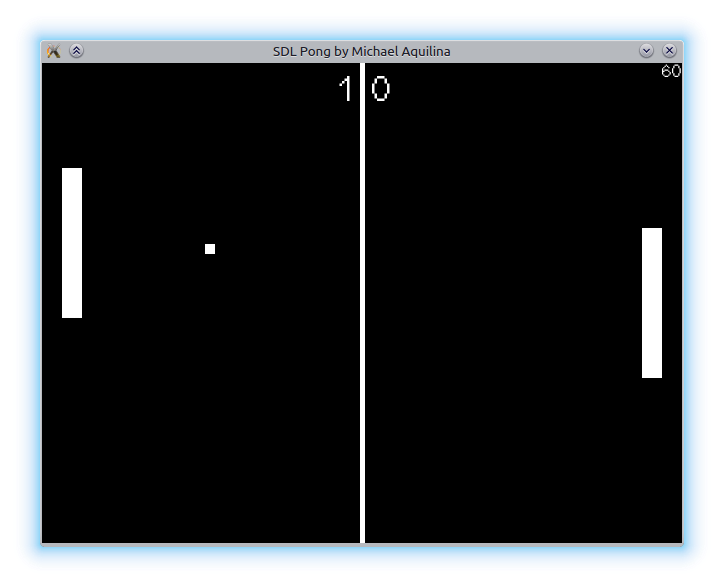

SDL2 Pong
==========

Simple implementation of pong using SDL2.0

This is a single player game with the second paddle being controlled by an *extremely* simple AI.

Controls
--------

Up - move up
Down - move down
Escape - Exit

Requirements
------------
You require the SDL2.0 development libraries along with the following extensions:
* SDL_ttf
* SDL_image

Building
--------
Simply Navigate to the src directory and type `make`

Executing
---------
Run `pong.exe`

Notes
-----
This was tested on a Linux machine (64bit) but should also work and compile on Windows and Mac OSX given the right development tools.
